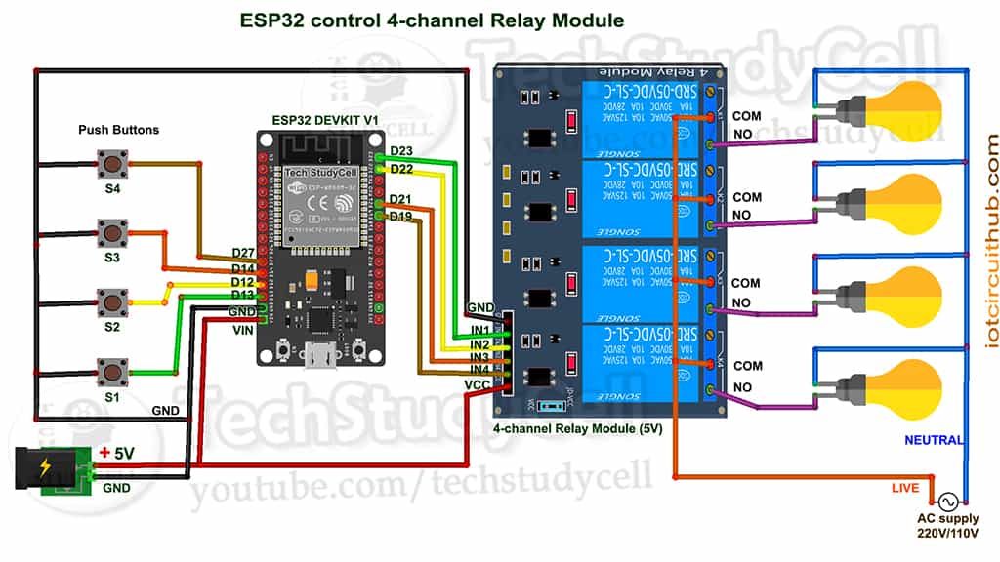

# Home Automation using ESP32

This project demonstrates a home automation system using ESP32, WiFi, and SinricPro to control relays and switches. The ESP32 is used to control up to four relays and switches, allowing for remote and manual control of connected devices.

## Circuit Diagram



## Components Used

- ESP32
- Relays
- Switches
- WiFi Network
- SinricPro Account

## Code Explanation

The provided code includes the following key components:

1. **Debug Configuration**

   Uncomment `#define ENABLE_DEBUG` to enable serial debug output.

   ```cpp
   //#define ENABLE_DEBUG

   #ifdef ENABLE_DEBUG
       #define DEBUG_ESP_PORT Serial
       #define NODEBUG_WEBSOCKETS
       #define NDEBUG
   #endif
   ```

2. **Libraries and Includes**

   Include necessary libraries for WiFi and SinricPro functionality.

   ```cpp
   #include <Arduino.h>
   #include <WiFi.h>
   #include "SinricPro.h"
   #include "SinricProSwitch.h"
   ```

3. **WiFi and SinricPro Credentials**

   Define your WiFi SSID, password, and SinricPro app key and secret.

   ```cpp
   #define WIFI_SSID "YOUR-WIFI-NAME"
   #define WIFI_PASS "YOUR-WIFI-PASSWORD"
   #define APP_KEY "YOUR-APP-KEY"
   #define APP_SECRET "YOUR-APP-SECRET"
   ```

4. **Device IDs**

   Define the device IDs for each relay/switch combination.

   ```cpp
   #define device_ID_1 "SWITCH_ID_NO_1_HERE"
   #define device_ID_2 "SWITCH_ID_NO_2_HERE"
   #define device_ID_3 "SWITCH_ID_NO_3_HERE"
   #define device_ID_4 "SWITCH_ID_NO_4_HERE"
   ```

5. **GPIO Pin Definitions**

   Define the GPIO pins connected to relays and switches.

   ```cpp
   #define RelayPin1 23
   #define RelayPin2 22
   #define RelayPin3 21
   #define RelayPin4 19

   #define SwitchPin1 13
   #define SwitchPin2 12
   #define SwitchPin3 14
   #define SwitchPin4 27

   #define wifiLed 2
   ```

6. **Main Configuration**

   Configure the devices using a map.

   ```cpp
   std::map<String, deviceConfig_t> devices = {
       {device_ID_1, { RelayPin1, SwitchPin1 }},
       {device_ID_2, { RelayPin2, SwitchPin2 }},
       {device_ID_3, { RelayPin3, SwitchPin3 }},
       {device_ID_4, { RelayPin4, SwitchPin4 }}     
   };
   ```

7. **Setup Functions**

   Setup relays, switches, WiFi, and SinricPro.

   ```cpp
   void setupRelays() { ... }
   void setupFlipSwitches() { ... }
   void setupWiFi() { ... }
   void setupSinricPro() { ... }
   ```

8. **Loop Function**

   Handle SinricPro events and flip switch states.

   ```cpp
   void loop() {
       SinricPro.handle();
       handleFlipSwitches();
   }
   ```

## How to Use

1. Replace the placeholders in the code (`YOUR-WIFI-NAME`, `YOUR-WIFI-PASSWORD`, `YOUR-APP-KEY`, `YOUR-APP-SECRET`, `SWITCH_ID_NO_1_HERE`, etc.) with your actual credentials and device IDs.
2. Connect the ESP32, relays, and switches according to the circuit diagram.
3. Upload the code to the ESP32 using the Arduino IDE.
4. Use the SinricPro app to control the devices remotely.

## License

This project is licensed under the MIT License.

## Acknowledgements

- [SinricPro](https://sinric.pro/)
- [Arduino](https://www.arduino.cc/)

